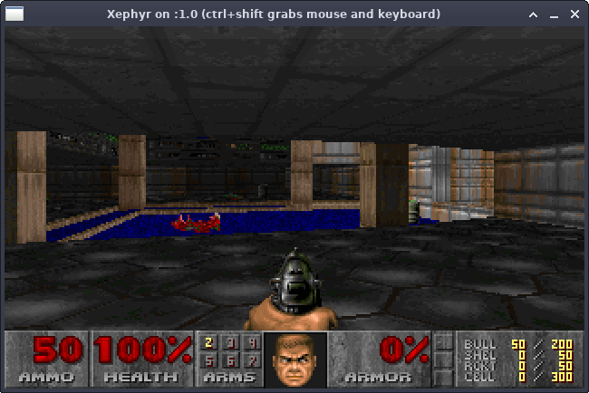

# DOOM (my fork)

This is a bare bones 32-bit linux fork of the original DOOM source code. The point of this fork is to apply as minimal changes as possible to run the game on modern linux. This git repository includes shareware DOOM1.WAD

## Main changes

- CMake for generating Makefile
- Minimal changes to fix compiler/linker errors
- Rewrite of i_video.c to integrate with SDL2



## Requirements

- CMake
- SDL2
- /dev/pcm
  - ALSA OssEmulation (snd-pcm-oss)
- 32-bit libraries to link against

## TODO

- Mouse does not work
- Music does not work

## Compiling & unning the game

The original linux DOOM uses /dev/pcm as a output sound device, this is not supported in modern Linux kernels. Thus we must emulate /dev/pcm to make the device available.

```bash
# enable ALSA pcm oss sound emulation
sudo modprobe snd-pcm-oss
# compile & run
cd build
./run_x86.sh
```
