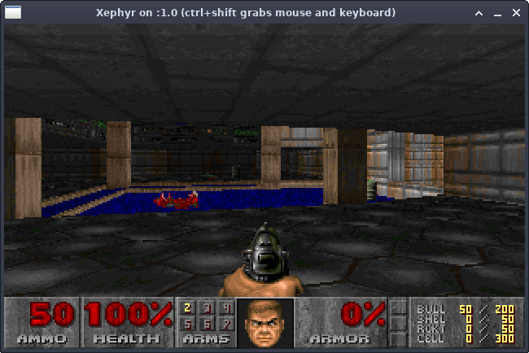

# DOOM (my fork)

This is a bare bones 64-bit linux fork of the original DOOM source code. The point of this fork is to apply as minimal changes as possible to run the game on modern linux. This git repository includes shareware DOOM1.WAD

## Main changes

- CMake for generating Makefile
- Minimal changes to fix compiler/linker errors
- Rewrite of i_video.c to integrate with SDL2
- Rewrite of i_sound.c to integrate with SDL2_Mixer

## Requirements

- CMake
- GCC
- SDL2
- SDL2_Mixer

## TODO

- Proper menu entry to toggle fullscreen
- Higher resolution support

